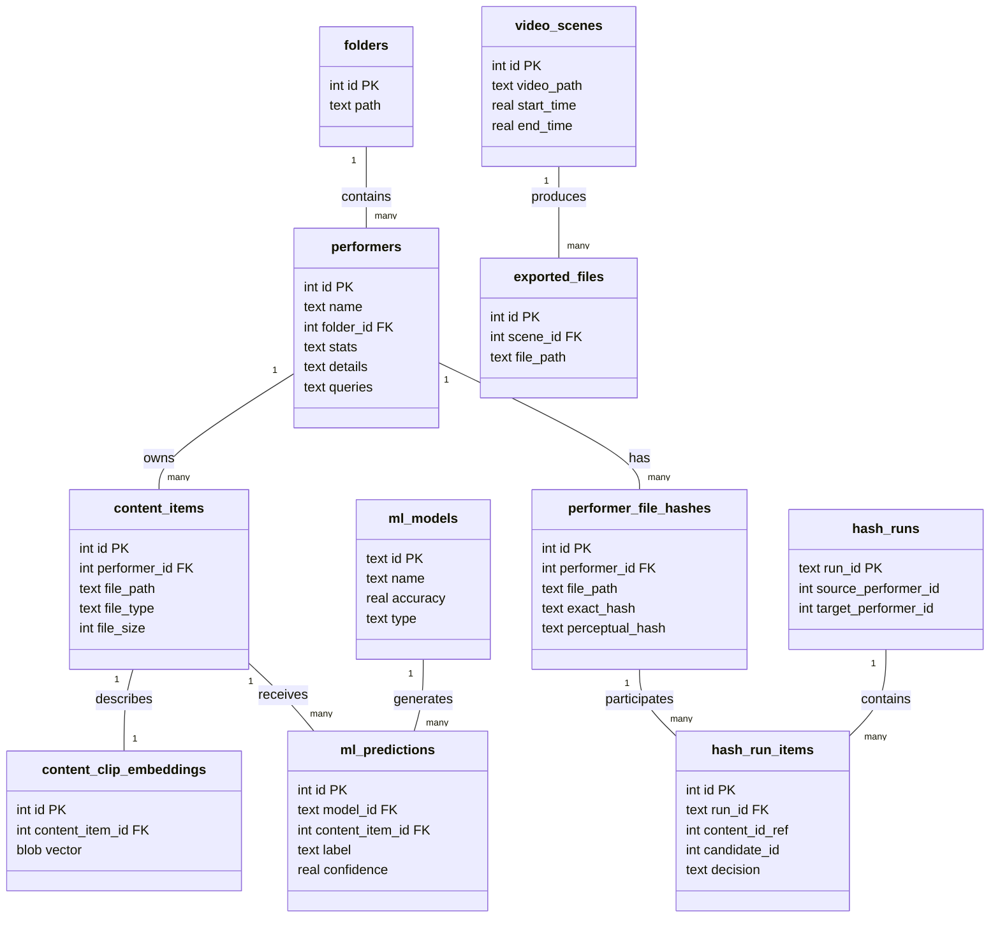

# Adult Content Manager
A comprehensive local adult content management system offering organization, deduplication, ML-based tagging, and device integration.

## Technology Stack
### Frontend
* **React 18**: Functional components with hooks and Context API.
* **Redux Toolkit**: Manages global state for batch operations, upload queues, and gallery data.
* **Material UI (MUI) v7**: Modern, responsive UI components with dark mode.
* **@hello-pangea/dnd**: Drag-and-drop support for organizing performers and files.
* **Recharts**: Visualization for library statistics and ML training metrics.
* **React Router v6**: Client-side routing for seamless navigation.

### Backend
* **Node.js + Express**: RESTful API server handling file operations and business logic.
* **SQLite (better-sqlite3)**: Zero-configuration, high-performance local relational database.
* **Socket.IO / WS**: Real-time bidirectional communication for progress bars and device events.
* **Sharp**: High-performance image processing (resizing, format conversion).
* **Python ML Service**: Dedicated microservice for computer vision tasks (CLIP embeddings, basic Face detection).

### Architecture Notes
*   **Dual-Service Architecture**: The backend orchestrates a Node.js main server and a Python ML subprocess. Communication happens via HTTP/IPC.
*   **Event-Driven Updates**: Long-running tasks (scanning, hashing, training) broadcast progress via WebSockets, ensuring the UI is always in sync.
*   **Performer-Centric Organization**: The file system structure (folder per performer) is the source of truth, mirrored and enhanced by the database.

## Application Structure (Key Files)

### Backend - Server
*   **`backend/index.js`**: Application entry point; initializes Express, Socket.IO, and background workers.
*   **`backend/db.js`**: Database schema definition and migration logic.
*   **`backend/config.js`**: Centralized configuration reading from environment variables.

### Backend - API Routes (`backend/routes/`)
*   **`performers.js`**: CRUD operations for performers, including metadata updates and stats.
*   **`gallery.js`**: Complex query logic for filtering and sorting content items.
*   **`files.js`**: Handles file serving, streaming range requests, and thumbnail generation.
*   **`ml.js`**: Proxy endpoints communicating with the Python ML service.
*   **`hashes.js`**: Management of file hashes for deduplication workflows.

### Frontend - Pages (`frontend/src/pages/`)
*   **`PerformerManagementPageNew.js`**: The primary workspace for organizing and auditing performers.
*   **`UnifiedGalleryPage.js`**: The main content browsing interface with advanced filtering.
*   **`MLManagementPage.js`**: Dashboard for managing ML models and training jobs.
*   **`HashManagementPage.js`**: Interface for reviewing and resolving duplicate file candidates.
*   **`BatchQueuePage.js`**: Management UI for background processing tasks.

### Frontend - Components (`frontend/src/components/`)
*   **`PerformerCard.js`**: Rich display card for performers showing stats, ratings, and actions.
*   **`ContentCard.js`**: Grid item for individual videos/images with hover previews.
*   **`FilterView.js`**: Advanced sidebar for filtering content by tags, attributes, and more.
*   **`GalleryView.js`**: Virtualized grid implementation for high-performance browsing.
*   **`ImportModal.js`**: UI for scanning and importing new folders/files.

## Database Schema Visual

## Proposed Changes
### Backend & Schema Improvements
#### [NEW] `schema/multi_performer_files.sql`
**Move beyond 1-to-1 Folder Mapping**
Currently, a file "belongs" to a performer because it resides in their folder. This restricts the ability to tag multiple performers in a single scene.
*   **Change**: Create a many-to-many link table `content_performers` (`content_item_id`, `performer_id`).
*   **Benefit**: Allows a single video file to appear in the galleries of *all* performers involved, not just the folder owner.

#### [NEW] `schema/playlists.sql`
**Virtual Collections**
Add a `playlists` and `playlist_items` table.
*   **Benefit**: Users can create "Favorites" lists, "Watch Later" queues, or thematic collections without moving files on the disk.

#### [NEW] `services/metadata_extraction.js`
**Rich Metadata**
Expand `content_items` to store technical metadata: `resolution`, `codec`, `duration`, `bitrate`.
*   **Benefit**: Allows filtering by quality (e.g., "Show only 4K videos").

### Frontend Enhancements
#### [MODIFY] `frontend/src/pages/PerformerManagementPageNew.js`
**Bulk Tagging Interface**
Add a mode to select multiple performers and apply tags/ratings in bulk. Currently, editing is done one-by-one.

#### [NEW] `frontend/src/pages/TimelineView.js`
**Chronological History**
A new view showing content additions over time ("Added Today", "Last Week"). Useful for seeing what the background scan has recently picked up.

## Verification Plan
### Automated Tests
*   **Backend Database**: `node backend/check_db.js` - Validates schema consistency.
*   **Performer Integrity**: `node backend/check_performers.js` - Audits database vs filesystem.
*   **Model Verification**: `node backend/check_models.js` - Ensures ML models load correctly.
*   **Frontend Tests**: `cd frontend && npm test` - Runs React component tests.

### Manual Verification
1.  **End-to-End Flow**: Import a new folder, verify it appears in `Unsorted`, move it to a Performer, and check `performers` table update.
2.  **Real-time Sync**: Open the app in two tabs. Rename a performer in one; verify instant update in the other via WebSocket.
3.  **Device Integration**: detailed test of the `handy.js` endpoints using the device emulator.
4.  **Mobile View**: Toggle Chrome DevTools to mobile view and verify the `PerformerCard` layout adjusts correctly.

## Questions for You
1.  **Deployment**: The current setup relies on TrueNAS/Docker. Do you have plans to deploy this to a cloud environment or a different local server OS?
2.  **ML Capabilities**: Are there specific computer vision tasks (e.g., specific act detection, full video segmentation) you want to prioritize next?
3.  **Authentication**: The app is currently open access on the local network. Do you require a login system?
